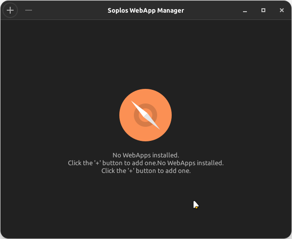
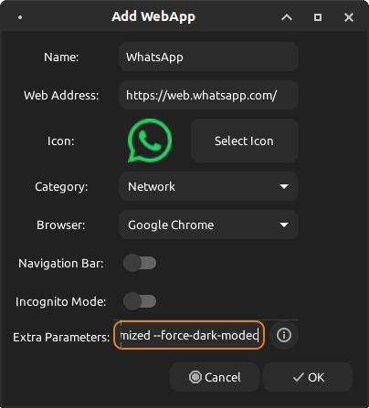
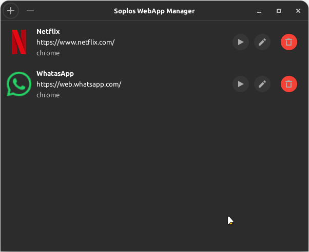

# Soplos WebApp Manager


**Soplos WebApp Manager** is an elegant, lightweight Site Specific Browser (SSB) engine tailored for Soplos Linux. It effortlessly turns any website into a standalone, desktop-integrated application utilizing isolated browser profiles for maximum privacy and separation from your primary web session.

## Screenshots

<div align="center">
  
  
  
</div>

## Features

- 🌐 **Multi-Engine Support**: Native or Flatpak versions of Firefox, Chrome, Chromium, Brave, Vivaldi, Edge, and Epiphany.
- ✏️ **Full WebApp Editing**: Reconfigure Name, URL, Icon, and Browser settings at any time without recreating the profile.
- ⚙️ **Extra Browser Parameters**: Add custom flags like `--start-maximized` or `--kiosk` with a new built-in help guide.
- 🔒 **Total Isolation & Incognito**: Generates sandboxed profiles and supports Incognito mode sessions.
- 🎨 **Soplos UI Integration**: Official status bar with automatic detection of DE (GNOME/Plasma/XFCE) and protocol (Wayland/X11).
- 🧩 **No-UI Implementation**: Customized Firefox launch using `userChrome.css` and dynamic StartupWMClass mapping.
- 🤖 **Smart Favicons**: HD icons automatically downloaded via Google Favicon API. 
- 🌍 **Internationalization**: Ships translated out-of-the-box for `es, en, fr, de, pt, it, ro, ru`.

## Requirements

- Python 3.10+
- GTK+ 3
- python3-gi
- At least one supported browser installed (native DEB/RPM or Flatpak).

## Installation

Usually shipped natively with Soplos Linux. To execute locally:

```bash
git clone https://github.com/SoplosLinux/soplos-webapp-manager.git
cd soplos-webapp-manager
python3 main.py
```

## Structure

```
soplos-webapp-manager/
├── assets/           # Icons and Desktop elements
├── core/             # Background logic (Profile generation, Binary detection)
├── debian/           # Deb packaging data
├── locale/           # Translation MO/PO strings
├── ui/               # GTK3 Interface
└── utils/            # Shared utilities (Favicon Fetcher)
```

## 🆕 New in version 1.0.0-3 (March 22, 2026)

- **UI colors**: Fixed background color inconsistency — window and list now use the correct Soplos dark theme color (#2b2b2b).

## New in version 1.0.0-2 (March 21, 2026)

- **About dialog**: Press F1 or use the GNOME application menu to open the About dialog.

## New in version 1.0.0-1 (March 10, 2026)

- **Official Soplos Footer**: Implemented a standard status bar following the Soplos ecosystem standard.
- **Environment Detection**: Added automatic identification of Desktop Environment (GNOME, Plasma, XFCE) and Protocol (Wayland, X11).
- **Incognito Mode**: New support for private browsing sessions with fully isolated profiles.
- **Extended Parameters Help**: Added a comprehensive guide for advanced browser flags and parameters.
- **UI Alignment**: Consistent use of `dim-label` styling and standard margins for seamless transition between Soplos apps.

## New in version 1.0.0 (March 4, 2026)

- **Full WebApp Editing**: Users can edit Name, URL, Icon, Browser, and Navigation Bar settings for existing WebApps.
- **Extra Browser Parameters**: Support for custom browser flags (e.g., `--start-maximized`, `--kiosk`) at creation and editing.
- **Improved Wayland Compatibility**: Enhanced icon mapping and window association for KDE Plasma 6 and other modern environments.
- **Independent Firefox Instances**: Optimized Firefox SSB behavior with truly isolated processes and dedicated icons.
- **Smart Favicons**: Fallback mechanism to download high-quality website icons via Google Favicons API.
- **Full Internationalization (i18n)**: Translation ready for the 8 default languages in Soplos Linux.

## License
This project is licensed under the GPL-3.0 License - see the [LICENSE](LICENSE) file for details.
